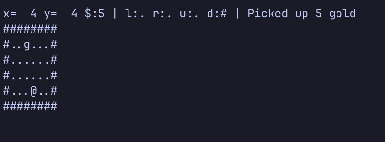
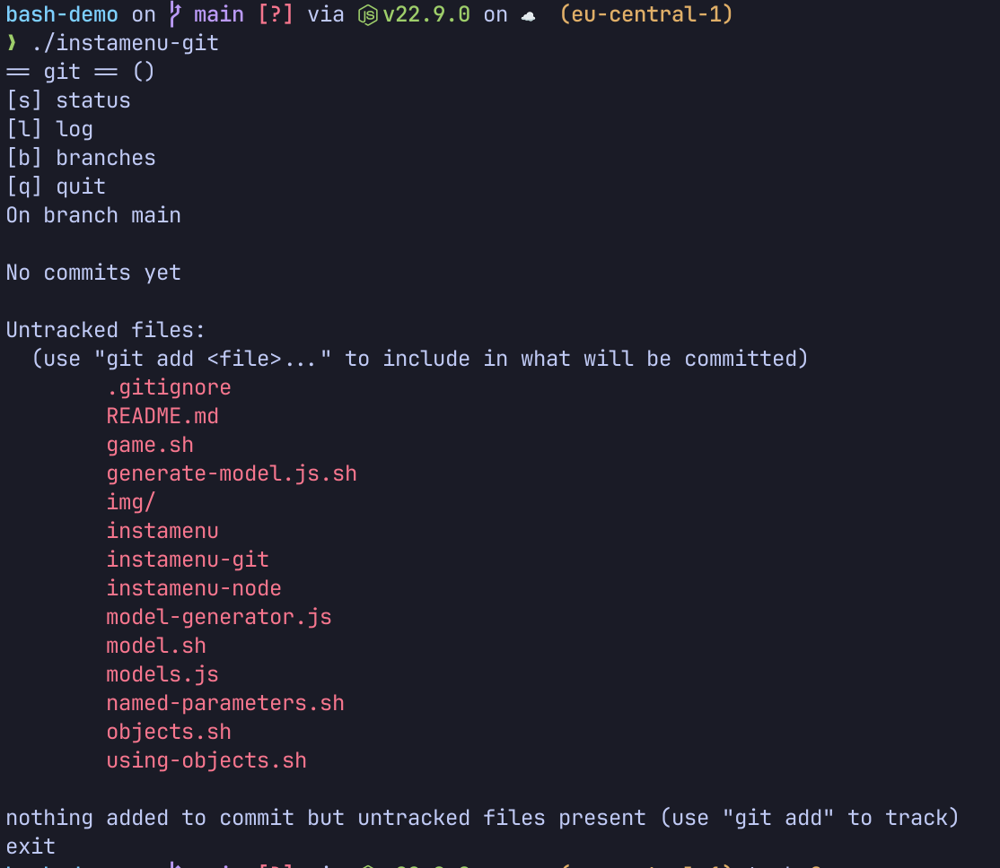

# Description

This repository holds a few examples of interesting uses of bash.

The building blocks provided by bash are simple,
so the interesting things happen when these blocks are combined.

## What's in the box

A small [game](./game.sh):



Start with:

```bash
bash --init-file game.sh -i
```

Key bindings:

- `h` move left
- `j` move down
- `k` move up
- `l` move right
- `q` quit

---

An object system, allowing you to write code like this:

```bash
source ./objects.sh

extend() {
  local class_name="$1"
  local mixin_name="$2"

  while read _ _ function_name; do
    if [[ "$function_name" =~ ^$mixin_name ]]; then
      local copy_of_function=$(declare -fp "$function_name")
      copy_of_function=${copy_of_function/$mixin_name::/$class_name::}
      eval "$copy_of_function"
    fi
  done < <(declare -Fp)
}

defclass Pallette
Pallette::define-color() {
  declare -gA "${class}_${id}_colors"
  local -n colors=${class}_${id}_colors
  local r g b
  r="${2:-0}"
  g="${3:-0}"
  b="${4:-0}"

  colors[$1]=$(printf '\033[38;2;%d;%d;%dm' "$r" "$g" "$b")
}
Pallette::color() {
  declare -gA "${class}_${id}_colors"
  local -n colors=${class}_${id}_colors
  printf "%s" "${colors[$1]}"
}

new Pallette log_colors
$log_colors define-color error 255 90 90
$log_colors define-color info 90 90 255

defclass Logger name level
Logger::log() {
  local message_level="$1"
  local message="${*:2}"

  if [ "$(this level)" != "$message_level" ] && [ "$(this level)" != "*" ]; then
    return
  fi

  case $message_level in
  error | info)
    $log_colors color "$message_level"
    ;;
  esac

  printf "%s: %s\e[0m\n" "$(this name)" "$message"
}
Logger::name() {
  this name
}

defclass ServerMixin
ServerMixin::run() {
  $this start
  $this listen
}

defclass App logger
extend App ServerMixin

App::start() {
  $(this logger) log info starting...
}
App::listen() {
  $(this logger) log error listen not implemented
}

new Logger default_logger 'app' '*'
new App the_app "$default_logger"
$the_app run

new Logger other_logger 'other' '*'
new App the_other_app "$other_logger"
$the_other_app run
```

---

A mongoose model generator:

```bash
#!/usr/bin/env ./model.sh

valid-types <<'>>'
string
ObjectId
Date
>>

model EmailMessage
field externalThreadId string
field threadId ObjectId
field rawBody string
with timestamps

model EmailThread
field externalThreadId string
field threadId ObjectId
field latestMessage EmailMessage
with timestamps
```

Which generates a Mongoose model together with the necessary TypeScript type definitions:

```ts
export interface EmailMessage {
  rawBody: string;
  externalThreadId: string;
  threadId: ObjectId;
  createdAt: Date;
  updatedAt: Date;
}
export const emailMessageModel = Type.Object({
  rawBody: Type.String(),
  externalThreadId: Type.String(),
  threadId: Type.ObjectId(),
  createdAt: Type.Date(),
  updatedAt: Type.Date(),
});
```

---

An interactive menu for your console:



Run it with `./instamenu-git`

Menus are defined with a simple DSL:

```bash
#!/usr/bin/env ./instamenu

menu git
key s 'status'    'git status'
key l 'log'       'git log --oneline -n 10'
key b 'branches'  'enter-menu git_branches'

menu git_branches branches
key l 'local'     'git branch -l'
key r 'remote'    'git branch -r'

```
